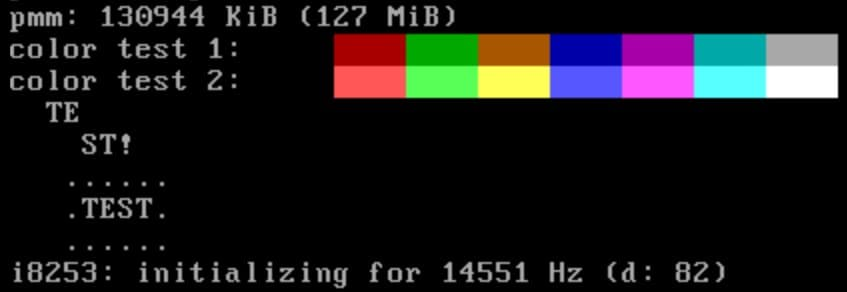

# libvterm
> Make your terminal emulator colorful!  

LibVTerm is an embeddable ANSI C89 (C90) library for parsing ANSI escape sequences.  
It is constructed in such way it requires only `ctype.h`, `string.h`, `stddef.h` and at least a malloc-styled allocation API.  

## Getting started
The library should be capable of compiling on virtually any C89-compliant C compiler so the repo doesn't contain any build scripts - you do it yourself!  
The way library communicates with the outer world is callbacks: libvterm has about 8 of them and 2 are required.  

#### System requirements
1. A reliable `void *malloc(size_t)`-ish function (libvterm doesn't check for `NULL` pointers upon allocation).
2. A reliable `void free(void *)`-ish function.

#### Callback descriptions
1. `mem_alloc` - allocate a block of N bytes. Required.
2. `mem_free` - free a previously allocated block. Required.
3. `misc_sequence` - allows parsing custom escape sequences specific for certain implementations.
4. `set_cursor` - updates the cursor position.
5. `mode_change` - implementation-specific actions upon video mode changes.
6. `draw_cell` - put a single cell to the screen.
7. `response` - write a byte back as a terminal response.
8. `ascii` - handle miscellaneous ASCII escape characters.

## Minimal example
~~This is taken from [Demos](https://github.com/undnull/demos) (from about [here](https://github.com/undnull/demos/blob/master/arch/x86_64/boot/tmvga.c))~~  
The above code doesn't exist anymore :)

#### Code
```c
static void on_misc_sequence(
    const struct vterm *vt, int chr)
{
    /* TMVGA driver supports DEC VT-220 "show/hide cursor" private
     * sequences because VGA CRTC can show and hide the hardware cursor */
    /* Some x86 port i/o stuff is going on here... */
}

static void on_set_cursor(
    const struct vterm *vt,
    const struct vterm_cursor *cursor)
{
    /* Again, TMVGA supports moving the cursor because VGA CRTC
     * has hardware cursor support so we don't need to emulate it. */
    /* Some more x86 port i/o stuff is going on here... */
}

static void on_draw_cell(
    const struct vterm *vt, int chr,
    unsigned int x, unsigned int y,
    const struct vterm_attrib *attrib)
{
    /* The colors in VGA text mode slightly differ from the colors
     * defined by the ANSI standard so this function remaps the colors
     * depending on the flags (like INVERT or BRIGHT) and writes the
     * character directly to the video memory. It also would be worth
     * noting that not all attributes may be supported by the implementation
     * so you are free to check for whatever you want to check for here. */
    /* Some x86 and VGA trickery is going on here... */
}

static struct vterm vt = { 0 };

int init_tmvga(/* ... some bootloader stuff ... */)
{
    struct vterm_callbacks callbacks;
    /* some unrelated code */
    
    /* Here we send the required memory allocation functions
     * to the library. Without them vterm_init will fail. */
    callbacks.mem_alloc = &kmalloc;
    callbacks.mem_free = &kmfree;
    
    /* These are not required by the library but without, say
     * draw_cell callback we won't be able to see anything! */
    callbacks.misc_sequence = &on_misc_sequence;
    callbacks.set_cursor = &on_set_cursor;
    callbacks.draw_cell = &on_draw_cell;
    
    vterm_init(&vt, &callbacks, NULL);
    
    /* some unrelated code */
}

```

#### Action!


